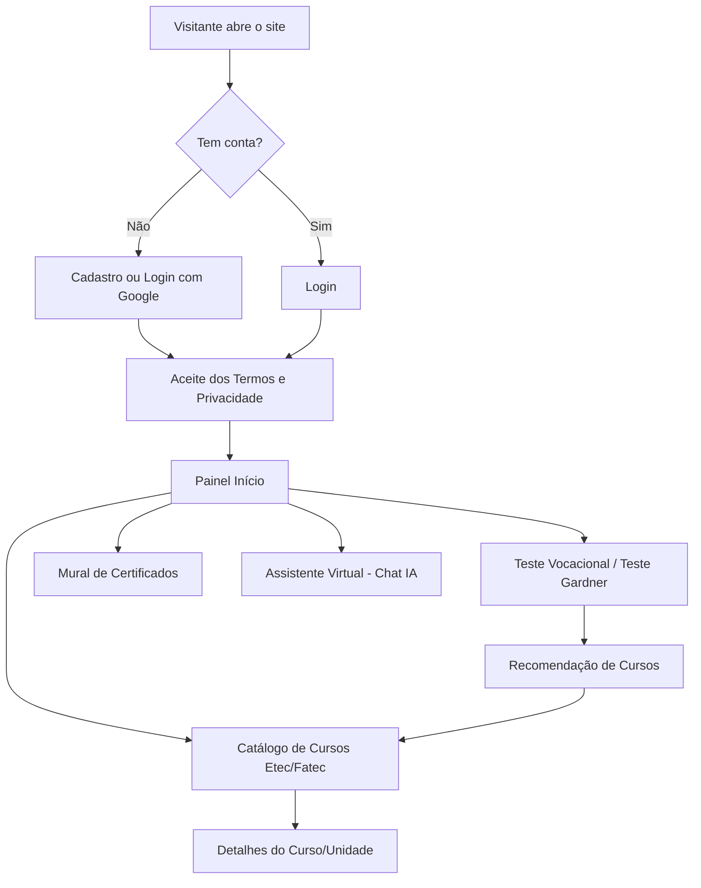
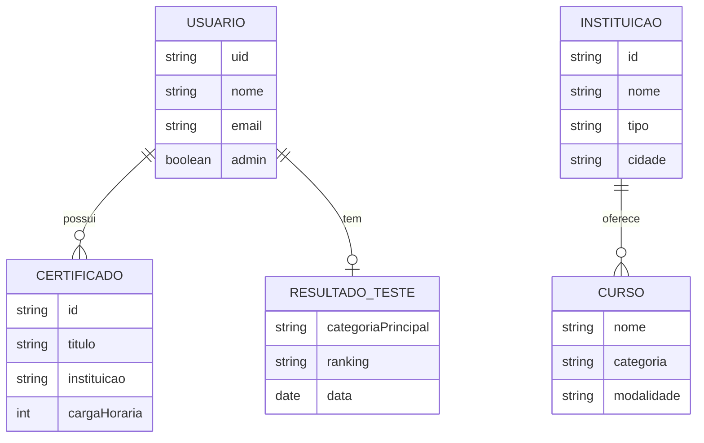

# FuturoPlus 🚀

O **FuturoPlus** é uma plataforma de orientação vocacional e profissional voltada para estudantes de Etecs e Fatecs. Ele ajuda o estudante a descobrir suas áreas de afinidade, escolher entre os cursos técnicos e tecnológicos do Centro Paula Souza e planejar os próximos passos até a matrícula.

O projeto nasceu com base em **Kotlin Multiplatform (KMP)** e **Compose Multiplatform** (Android/iOS), e hoje tem sua interface principal ativa em uma **Web App** desenvolvida em **JavaScript puro (Vite)**, além de um assistente virtual com IA rodando em **Cloud Functions (Python)**.

---

## 🌟 Como Funciona

* **Descubra seu perfil:** o estudante faz o Teste Vocacional completo ou um teste rápido baseado na teoria das inteligências múltiplas de Howard Gardner (por afinidades ou por perguntas diretas — os dois dão o mesmo resultado).
* **Explore os cursos:** um catálogo com os cursos técnicos e tecnológicos de Etecs, Fatecs e outras instituições, com busca, filtros por proximidade, modalidade e tipo de instituição.
* **Guarde suas conquistas:** o Mural de Certificados centraliza cursos extras já concluídos, com o CPF borrado automaticamente ao enviar o certificado.
* **Tire dúvidas na hora:** um assistente virtual (chatbot com múltiplos agentes de IA) responde sobre editais, cotas, isenção de taxa, vagas, unidades mais próximas e notícias dos vestibulares, buscando na web e nos manuais oficiais do Centro Paula Souza.

## 🚀 Diferencial Competitivo

Em vez de recomendar cursos genéricos, o **FuturoPlus** cruza o resultado do teste vocacional/Gardner do estudante com o catálogo real de cursos das Etecs e Fatecs (com pré-requisitos, eixos e regras de especialização do CPS), indicando cursos de verdade — e não só uma área de interesse abstrata.

## 🛠️ Tecnologias Utilizadas

* **JavaScript (Vanilla) + Vite:** interface Web principal, leve e sem framework.
* **Firebase Authentication:** login por e-mail/senha e login com Google.
* **Firebase Firestore:** cadastro de instituições/cursos, perfis, resultados de teste e certificados do mural.
* **Firebase Cloud Functions (Python) + OpenAI Agents SDK:** assistente virtual com agentes especializados (manuais/RAG, notícias/web) e roteamento automático por assunto.
* **Tavily API:** busca na web para informações em tempo real (vagas, notícias, links oficiais).
* **Kotlin Multiplatform (KMP) + Compose Multiplatform:** base compartilhada para Android e iOS.
* **GitLive Firebase SDK:** integração multiplataforma dos serviços Firebase no KMP.

## 📱 Status das Funcionalidades

* ✅ **Autenticação:** login/cadastro por e-mail e por Google, exclusão de conta com carência de 30 dias.
* ✅ **Teste Vocacional e Teste de Inteligências (Gardner):** dois formatos de teste com o mesmo resultado final.
* ✅ **Catálogo de Cursos:** busca, filtros e recomendação ligada ao resultado do teste.
* ✅ **Mural de Certificados:** upload de certificados com borrado automático de CPF.
* ✅ **Assistente Virtual com IA:** chatbot multiagente (manuais, notícias, unidades) com guardrails de segurança.
* ✅ **Termos e Privacidade:** aceite obrigatório com reconsentimento sempre que o conteúdo muda.
* ✅ **Tour guiado:** tutorial interativo de primeira visita, com destaque nas principais telas.
* ✅ **Área administrativa:** gestão de instituições, cursos e Termos/Privacidade.

## 🚀 Como Rodar o Projeto

### Web
1. Navegue até a pasta `webApp/` e instale as dependências: `npm install`.
2. Rode o servidor de desenvolvimento: `npm run dev`.
3. Acesse o endereço mostrado no terminal (por padrão, `http://localhost:5173`).

### Assistente Virtual (Cloud Functions)
1. Navegue até a pasta `functions/` e instale as dependências Python: `pip install -r requirements.txt`.
2. Configure as chaves de API necessárias (OpenAI, Tavily) em um arquivo `.env`.
3. Rode localmente com o emulador do Firebase: `firebase emulators:start`.

### Android
1. Adicione o `google-services.json` em `androidApp/`.
2. Execute a configuração `androidApp` no Android Studio.

### iOS
1. Adicione o `GoogleService-Info.plist` em `iosApp/`.
2. Abra `iosApp` no Xcode e instale as dependências via SPM.
3. Clique em Run.

## Fluxograma do Site (simplificado)

---

## Diagrama de UML (simplificado)

